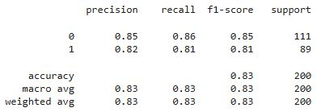
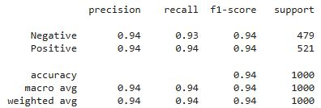

# LLM Project

## Project Task
This is a sentiment analysis tool that interprets IMDB movie review sentiments and classifies it as either positive (1) or negative (0). The tool is a LLM that is finetuned and optimized based on a pretrained HuggingFace model for movie review sentiment analysis. The model's performance is evaluated by classification metrics, then compared with a baseline Logistic Regression model as well as the pretrained model before finetuning and optimization. 

## Dataset
The dataset used for training is the IMDB `train` dataset from the datasets library. It contains 25000 rows of movie reviews and its associated label (1 or 0). The data is preprocessed by removing ` ` HTML tags, replacing punctuation with empty space (except apostrophe), and standardizing to lower case. The baseline Logistic Regression model was trained on all datapoints, and 200 datapoints each were selected for the training and evaluation of the fine-tuned model.    

## Pre-trained Model
I selected the `Movie_review_sentiment_analysis_model` (Model ID 1883864250) from `JamesH` as my pre-trained model to fine tune. 

## Performance Metrics
The model performs a binary classification task, the classification metrics are considered during evaluation. 

### Logistic Regression model 

### Pretrained model before finetuning and optimization 

### Final evaluation metrics deployed: 

`Loss`: 0.2338  
`Accuracy`: 0.95  
`F1`: [0.946236559139785, 0.9532710280373832]  
`Precision`: [0.946236559139785, 0.9532710280373832]  
`Recall`: [0.946236559139785, 0.9532710280373832]  
`Auc`: 0.9885
(positive, negative)

## Hyperparameters

The following hyperparameters were tuned during optimization: 

`learning_rate`: 1.2090707659718472e-05  
- The most significant hyperparamter, my model's optimal rate is in the lower range of my hyperparameter search space. As a result the training and optimization took several minutes.
  
`warmup_ratio`: 0.09356655990374085  
- Near the higher spectrum of my hyperparameter space, stablized the training in the first epoch.
  
`num_train_epochs`: 4   
- Not as significant as the others, during optimization many trials saw no difference or diminishing returns after the third epoch.

